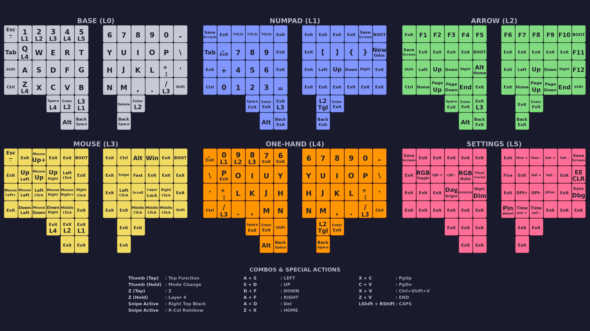

# Charybdis OS

Auto-switching layers, do everything with just your left hand, layers / modes color coded so you know where you are, extensive logging, auto generate wallpaper and PDF.

Touch the trackball and your keys become mouse buttons. Let go and you're back to typing. No mode switching. No thinking.

**Built for developers who live in the terminal and hate reaching for a mouse.**



*Auto-generated from source. [Download the PDF](charybdis_layout.pdf) for print or set the wallpaper as your desktop background while you learn the layout.*

---

## Highlights

| Feature | What it does |
|:--------|:-------------|
| **Auto-Mouse Layer** | Trackball movement activates mouse keys instantly. Release and you're back to typing. |
| **Modal Layers** | Tap to type, hold to toggle. Work like Vim—enter a mode, do your thing, exit. |
| **Sniper Mode** | One key drops DPI for pixel-perfect precision. |
| **Layer-Coded RGB** | White/Blue/Green/Yellow/Pink tells you where you are at a glance. |
| **Flashlight Mode** | Double-tap `Z` to blast 58 LEDs and find your coffee. |
| **Split Sync** | Both halves stay perfectly in sync via custom transaction protocol. |
| **Live Diagnostics** | Streams real-time matrix scans, trackball state, and internal logic to `qmk console`. |

---

## Hardware
- **Keyboard:** BastardKB Charybdis 4x6 (Nano)
- **Controller:** Splinky (RP2040) / Elite-Pi (RP2040)
- **Trackball:** Integrated Right-side Trackball (PMW3360 sensor)
- **Switches:** (Add switch type if known, e.g., Silent Alpacas)

## Layers
The RGB matrix changes color based on the active layer:

| Layer | Name | Color | Description |
| :--- | :--- | :--- | :--- |
| **0** | **BASE** | White | Default QWERTY typing layer. |
| **1** | **SYMBOLS** | Blue | Numbers, symbols, and navigation. |
| **2** | **MEDIA** | Green | Function keys (F1-F12), media controls, volume. |
| **3** | **MOUSE** | Yellow | Mouse clicks, scrolling, DPI, Sniping. (Auto-activates on move) |
| **4** | **ONE-HAND** | Pink | Mirrored layout for one-handed typing. |
| **3** | **MOUSE LOCK** | Orange | Locked mouse layer (toggled via key). |
| **-** | **FLASHLIGHT** | White | Max brightness white (Double-tap Z). |

## Generating Layout Docs

The wallpaper and PDF are auto-generated from `keymap.c`. After editing your layout, regenerate them:

```bash
python3 generate_layout_pdf.py   # Creates charybdis_layout.pdf
python3 wallpaper.py             # Creates wallpaper.png
```

## Keymap Files

The keymap source code is stored directly in the `keymap/` directory of this repository.

To allow QMK to build it, a **symlink** has been created inside the QMK firmware directory:
- **Source:** `keymap/` (This repo)
- **Destination:** `qmk_firmware/keyboards/bastardkb/charybdis/4x6/keymaps/dcar` (Symlink)

**How to Edit:**
Simply edit the files in `keymap/` (`keymap.c`, `config.h`, `rules.mk`). The symlink ensures QMK always sees the latest changes.

**Note:** This structure ensures your custom keymap is safely backed up in this repository, even without forking the entire QMK firmware.

## Compilation & Flashing

### Prerequisites
- QMK CLI installed
- `arm-none-eabi-gcc` toolchain (usually handled by QMK)

### Compile Command

**Quick Build (Recommended):**
```bash
./build.sh
```

**Manual Command:**
```bash
qmk compile -kb bastardkb/charybdis/4x6/elitec -km dcar -e CONVERT_TO=elite_pi
```

**IMPORTANT:** This keyboard uses Elite-Pi (RP2040), not Elite-C (AVR). The `-e CONVERT_TO=elite_pi` flag is required!

### Flash Command
**IMPORTANT: For split RGB to work, you must flash BOTH controllers!**

The compiled UF2 file will be in the `qmk_firmware` directory.

1. **Flash the right side (master with trackball):**
   - Put it in bootloader mode (double-tap reset OR hold BOOT while plugging USB)
   - Copy the `.uf2` file: `cp bastardkb_charybdis_4x6_elitec_dcar_elite_pi.uf2 /media/$USER/RPI-RP2/`

2. **Flash the left side (slave):**
   - Disconnect TRRS cable
   - Put left controller in bootloader mode (hold BOOT continuously while plugging USB)
   - Copy the SAME `.uf2` file: `cp bastardkb_charybdis_4x6_elitec_dcar_elite_pi.uf2 /media/$USER/RPI-RP2/`

3. **Reconnect everything:**
   - Reconnect TRRS cable
   - Plug USB into right side (master)

## Custom Keycodes & Combos
- **`TD(TD_Z_LAYER)`**: Tap for 'Z', Hold for Mouse Layer, Double-tap for Flashlight Mode.
- **Combos**:
  - `Ctrl+C` (Copy): A + S
  - `Ctrl+V` (Paste): S + D
  - `Ctrl+Shift+V` (Paste Special): D + F
  - `Ctrl+Shift+C` (Copy Special): A + F
  - `Delete`: J + K
