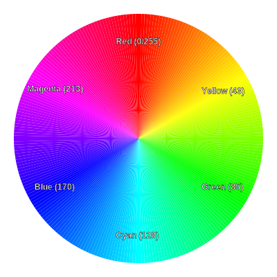

# RGB Lighting Guide (HSV Controls)

Your keyboard uses **HSV** (Hue, Saturation, Value) to control lighting colors. This is often more intuitive than mixing Red/Green/Blue values manually.

## Controls (Layer 1 - Right Side, Bottom Row)

| Key | Label | Function | Description |
|---|---|---|---|
| **RM_HUEU** | Hue + | **Change Color** | Cycles forward through the rainbow (Red -> Orange -> Yellow -> Green -> Blue -> Purple). |
| **RM_HUED** | Hue - | **Change Color** | Cycles backward through the rainbow. |
| **RM_SATU** | Sat + | **More Color** | Makes the color more vivid (closer to the pure color). |
| **RM_SATD** | Sat - | **Less Color** | Makes the color paler/whiter (0 = White/Gray). |
| **RM_VALU** | Brt + | **Brighter** | Increases LED brightness. |
| **RM_VALD** | Brt - | **Dimmer** | Decreases LED brightness (0 = Off). |

## How to use

## Understanding Hue (The Color Wheel)

Think of Hue as a position on a 360-degree color wheel (mapped to 0-255 steps in QMK).

- **0:** Red
- **43:** Yellow
- **85:** Green
- **128:** Cyan (Light Blue)
- **170:** Blue
- **213:** Magenta/Pink
- **255:** Red (cycles back)

When you press `Hue +`, you are moving around this wheel clockwise. When you press `Hue -`, you move counter-clockwise.

## Examples

### How to get Pink?
Pink is a mix of Red and Blue (Magenta).
1.  **Set Mode:** Ensure you are in a Solid Color mode (or one that uses the base color).
2.  **Saturation:** Press `Sat +` repeatedly to ensure you have full color (not white).
3.  **Find Red:** Press `Hue -` until you see pure Red.
4.  **Find Pink:** Press `Hue -` a few more times (going backwards from Red wraps around to Purple/Pink) OR press `Hue +` and go past Blue. Pink/Magenta sits right between Blue and Red.

### How to get White?
Hue doesn't matter for white.
1.  **Saturation:** Press `Sat -` repeatedly until all color is drained away. You are left with pure light (White).

- The "Auto Cycle" mode (`RGB Auto`) ignores Hue/Saturation adjustments as it cycles through all colors automatically.
- These controls affect "Solid Color", "Breathing", and other single-color modes.
